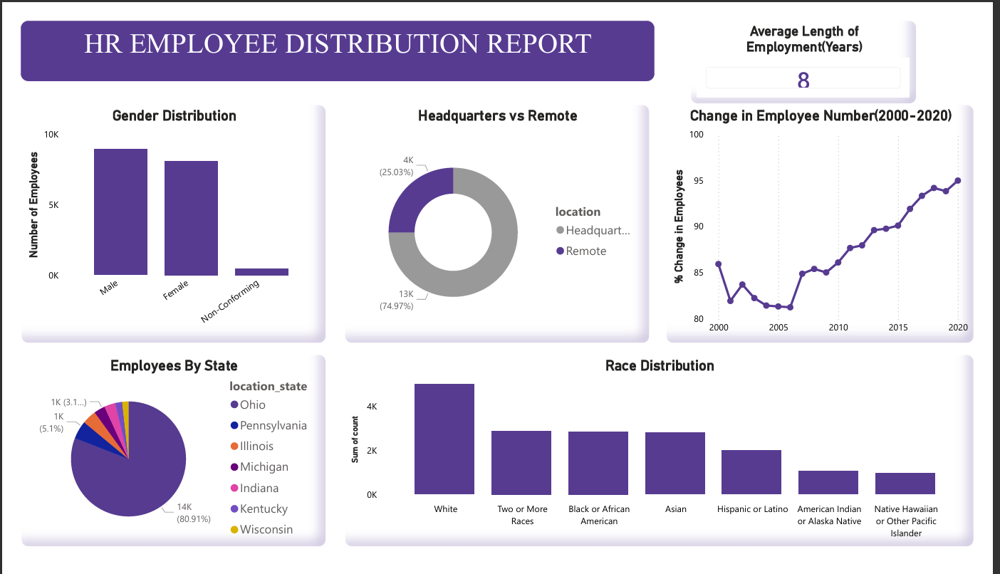
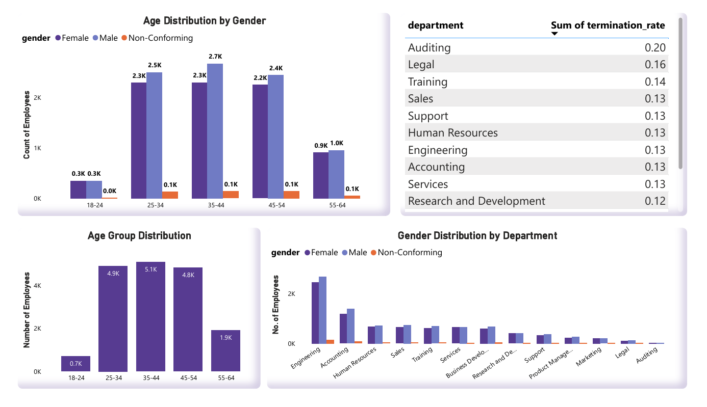

# 📊 HR Dashboard Analysis (MySQL + Power BI)

## 📌 Overview
This project focuses on analyzing HR data to uncover insights about employee distribution, demographics, and organizational trends. The dataset contains over 22,000 employee records from 2000 to 2020.

The project combines **SQL (MySQL)** for data cleaning and analysis with **Power BI** for interactive dashboard visualization.

---

## 📊 Dashboard Preview

---

## 🛠️ Tools & Technologies
- **MySQL Workbench** → Data Cleaning & Analysis  
- **Power BI** → Data Visualization  
- **Dataset** → HR dataset (22,000+ rows)

---

## ❓ Business Questions Answered
- What is the gender breakdown of employees?
- What is the race/ethnicity distribution?
- What is the age distribution of employees?
- How many employees work at headquarters vs remotely?
- What is the average tenure of terminated employees?
- How does gender distribution vary across departments and job roles?
- What is the distribution of job titles?
- Which department has the highest turnover rate?
- What is the employee distribution by state?
- How has employee count changed over time?
- What is the average tenure per department?

---

## 📊 Key Insights

- 👥 There are more **male employees** compared to female employees.
- 🧬 **White** is the most dominant race group, while **Native Hawaiian and American Indian** are the least represented.
- 🎂 Employee ages range from **20 to 57 years**.
- 📊 Most employees fall in the **25–34 age group**, followed by **35–44**.
- 🏢 Majority of employees work at the **headquarters**, with fewer working remotely.
- ⏳ The average tenure of terminated employees is around **7 years**.
- ⚖️ Gender distribution across departments is fairly balanced, though males are slightly higher.
- 🔄 The **Marketing department** has the highest turnover rate, followed by **Training**.
- 📉 Lowest turnover is seen in **R&D, Support, and Legal** departments.
- 🌍 Most employees are located in **Ohio**.
- 📈 Employee count has **increased over time**, showing company growth.
- 🧠 Average tenure across departments is around **8 years**, with:
  - Highest → Legal & Auditing  
  - Lowest → Services, Sales, Marketing  

---

## ⚠️ Data Cleaning & Limitations

- ✅ Only considered:
  - Employees aged **18 and above**
  - Valid termination dates (≤ current date)
- 🔄 Replaced invalid values like `'0000-00-00'` with `NULL`

---

## 📈 Dashboard Features
- Employee distribution by gender, race, and age
- Location analysis (Headquarters vs Remote)
- Department-wise employee count
- Turnover rate analysis
- Year-wise employee growth trend
- State-wise employee distribution

---

## 🚀 Conclusion
This project demonstrates how data analysis can be used to understand workforce trends, identify high-attrition areas, and support data-driven HR decisions.

---

## 💼 Author
**Rohan**  
Aspiring Data Analyst | SQL | Python | Power BI
